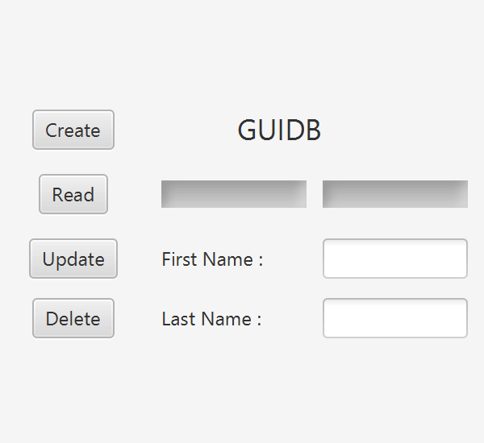

# GUIDB
<h2>Project Overview</h2>

With this enhanced version the user make create new authors, read through or update the existing authors, and delete authors. The end product is a window that pops up with a clear interface for the user.   When a name is entered, the user may create that author, update an existing author to the new name, or delete the currently shown author. Additionally, the user can read through the existing database of authors.

<h2>Example in action</h2>

Below is a gif of the program in action

<b><u>Steps</u></b>
<ol>
  <li>Read through the database<li/>
  <li>Create a new author<li/>
  <li>Update an existing author<li/>
  <li>Delete an author<li/>
</ol>
